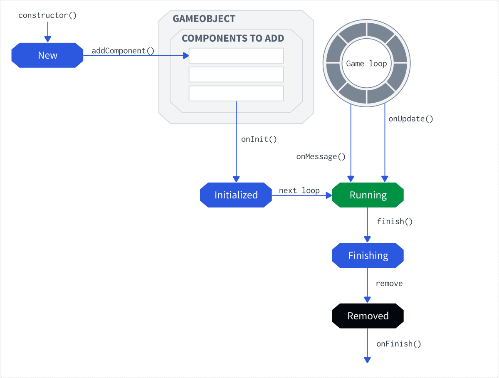
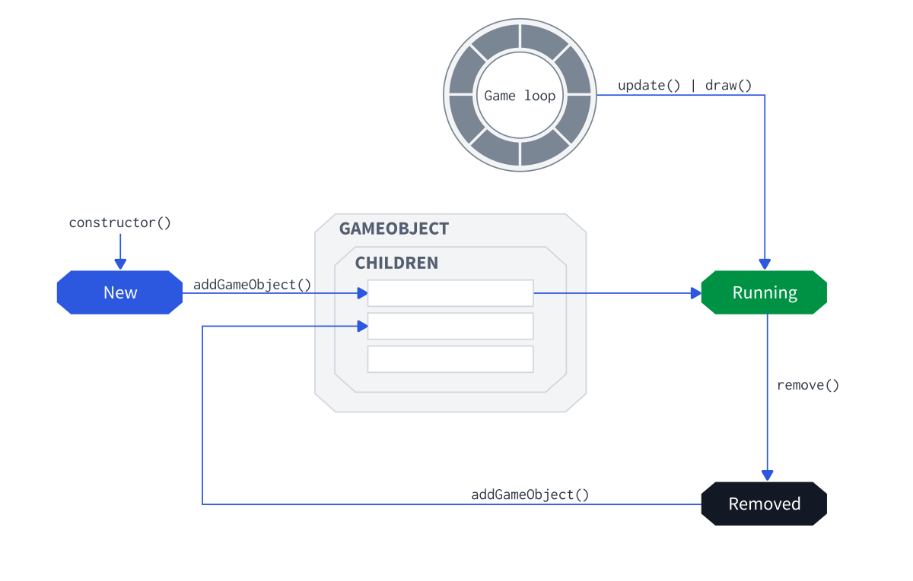
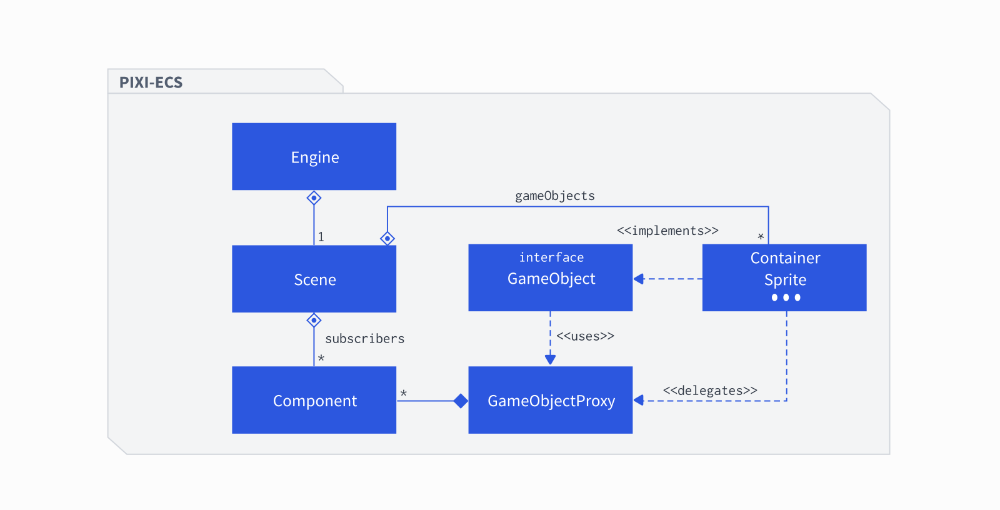
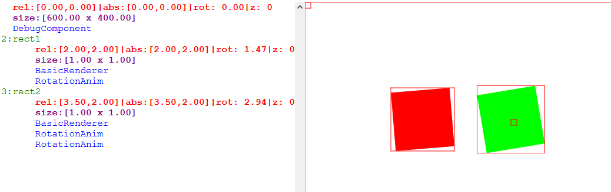

# ECSLite

ECSLite is an experimental Entity-Component-System library written in JavaScript with educational intentions, hence it should be very easy to learn to make simple casual games.


## Features
- Built in TypeScript on top of [PixiJS](https://pixijs.com/) library
- Scene Graph
- Game Loop
- Messaging system
- Asynchronous components

## Goals
The goal for ECSLite is to be a lightweight and simple library that could be used for educational purposes. Therefore, it doesn't aim to provide complex features of HTML5 game engines. Instead, it should teach developers the basics of component-oriented programming

## Examples
- see the examples folder
- executor.html - an example how **Executor** component works
- executor2.html - another Executor example
- rotation.html - rotation animation


# Usage
- this library uses PixiJS and Parcel Bundler
- you need to have NodeJS 14+ version installed
- installation: `npm install`
- running: `npm start`
- you can find all examples at `localhost:1234`, e.g., `localhost:1234/executor.html`

- here is an example of a HTML code that will run the engine

```html
<!DOCTYPE html>
<html lang="en">

<head>
	<meta content="text/html;charset=utf-8" http-equiv="Content-Type">
	<meta content="utf-8" http-equiv="encoding">

</head>

<body>
	<canvas id="gameCanvas" width="600" height="400"></canvas>
	<script src="./index.ts"></script>
</body>
</html>
```

- and `index.ts`

```typescript
import GameLoop from '../src/engine/GameLoop';

newGame(new GameLoop());
// Start a new game
function newGame(engine: GameLoop) {

}

```


## How does it work?
- the logic is implemented inside components - you declare a component, attach it to a game object, and via its `update` method, you can update the state

### Components
- each component has the following lifecycle functions:
  - `onInit` - initializes the component
  - `onMessage` - sends a message to all subscribed components
  - `onUpdate` - called during the game loop, updates the component state
  - `onFinish` - called whenever this component has finished its execution
- if you want to add a new component to a game object, you have to call `addComponent` - it will add it to the queue of new components that will be added in the end of the loop
- any component can be terminated via `finish()` function



- example: creating a simple rectangle

```javascript
    let rect1Gfx = new PIXICmp.Graphics();
    rect1Gfx.beginFill(0xfff012, 1);
    rect1Gfx.drawRect(0, 0, 100, 100);
    rect1Gfx.position.set(200, 200);
    rect1Gfx.pivot.set(50,50);
    rect1Gfx.addComponent(new RotationAnim());
    engine.scene.stage.getPixiObj().addChild(rect1Gfx);
```

### Game Objects
- game objects form a tree-like structure called Scene Graph. Any transformation of an object applies to its children as well
- each object is added to the scene instantly
- every object has one main function: `onUpdate()` that calls all components attached to the object and calls respective functions upon them
- game objects have these important properties:
  - `tag` - a string that identifies the object
  - `pixiObj` - attached object from PIXI library
  - `attributes` - list of attributes that can be accessed via string keys
  - `numState` - a numeric state
  - `flags` - a bit array of flags



### Packages
- **Scene** - serves as a message bus and scene manager, contains global components, game objects, and attributes
- **Component** - a basic unit of the ECS pattern. Components are attached to game objects, can subscribe to the messaging system via `subscribe()` and send messages to other components via `sendmsg`
- **GameObject** - game objects are mere containers for components and attributes



## API
- this is a documentation of the most important parts. Since the engine is very small, you can investigate all functions on your own by taking a look at the codebase. Each function and property has a JSDoc


### Scene
- `invokeWithDelay`
  - can call an action with a delay

```javascript
scene.invokeWithDelay(0.5, () => {
  playSound(ASSETS_SND_NEW_GAME);
});
```

- `addGlobalComponent`
  - attaches a component to the root (stage) object
- `findAllObjectsByTag`
  - allows to find objects by their tags
- `clearScene`
  - removes all components and objects from the scene
- `sendMessage`
  - sends a message to all subscribed components. Note that components also have this function which is easier to use as it passes some metadata from the component itself

### Flags
- `flags` is a bit array you can use to your own needs
- example:

```javascript
myObject.setFlag(12);
myObject.hasFlag(12); // true
myObject.resetFlag(12);
myObject.hasFlag(12); // false
```

### GameObject
- game objects are only shells for components and attributes
- `numState` is a numeric state you can use to implement a simple state machine
- `flags` is a bit array described above

### Msg
- messaging system uses a class `Msg` to store data
- `action` - action key (string), used by the components to subscribe for a certain group of messages
  - special actions: 
    - `ANY` that is sent to **each** component
    - `OBJECT_ADDED` that is sent to inform subscribed components that a new game object has been added
    - `OBJECT_REMOVED` that is sent to inform subscribed components that an existing game object has been removed
    - `STATE_CHANGED` - when a state of an object has changed
    - `COMPONENT_ADDED` - component has been added
    - `COMPONENT_REMOVED` - component has been removed 
- `component` - a component that sent the message
- `gameObject` - a game object to which the component that sent the message belongs
- `data` - any custom payload

### Component
#### Component API
- `onInit` - initializes the component
- `subscribe(action)` - subscribes for messages with a given action
- `unsubscribe(action)` - unsubscribes a message
- `sendMessage` - sends a message
- `onMessage` - called whenever the component receives a message
- `onUpdate` - game loop, called each 16ms, used to update the component's state
- `onFinish` - called when the component is about to be finished and removed
- `finish` - will terminate the component and remove it from the game object


### Built-in components
#### DebugComponent
- displays a debugging info - very handy!




#### Animation
- TranslateAnimation - for translation

```javascript
let translateAnim = new TranslateAnimation(
    fromX, 
    fromY,
    toX,
    toY, duration);
```

- RotationAnimation - for rotation

```javascript
let rotateAnim = new RotationAnimation(
    from, 
    to,
    duration);
```

#### TouchInputComponent
- used for mouse/touch input
- first you need to specify what you want to capture
  - example: DOWN + MOVE: `new InputManager(INPUT_DOWN | INPUT_MOVE)`
- then you just use any component you like to subscribe to the following actions:
  - `MSG_TOUCH` - touch event
  - `MSG_DOWN` - pointer down event
  - `MSG_UP` - pointer up event
  - `MSG_MOVE` - pointer move event

#### ComposingComponent
- a component that contains a set of other components

#### DynamicsComponent
- a helper that can be used to work with velocities

#### GenericComponent
- a functional component
- example: a very simple rotation animation

```typescript
myObj.addComponent(new GenericComponent()
  .doOnInit((cmp) => cmp.owner.rotation = 0)
  .doOnUpdate((cmp, delta, absolute) => cmp.owner.rotation += 0.1)
);
```

#### KeyInputComponent
- keyboard handler
- example:

```typescript
const keyInput = new KeyInputComponent();
myObj.addComponent(keyInput);

// ... onUpdate:
const isSpacePressed = keyInput.isKeyPressed(' '.charCodeAt(0));
```

#### ChainingComponent
- this component is extremely powerful - you can use callbacks to implement a very complex behavior
- see `executor.html` for more information
- example: rotation every second

```javascript
myObj.addComponent(new ChainingComponent()
  .beginInterval(1000)
  .execute((cmp) => cmp.owner.rotation += 0.1)
  .endInterval()
);
```


### PIXIObjectBuilder
- used to simplify game object creation

```javascript
  let obj = new PIXIObjectBuilder(scene)
  .localPos(2,2)
  .withComponent(new Executor()
      .beginRepeat(0)
      .addComponentAndWait(() => new RotationAnimation(0,1,1)) 
      .addComponentAndWait(() => new TranslateAnimation(1,1,2,2,1))
      .endRepeat()
  )
  .build(myPixiObject);
```

### Tests
- to make this repo as tiny as possible, there is no jest/mocha etc. The tests can be run by simply opening the `examples/tests.html` file in your browser
