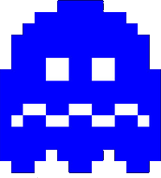
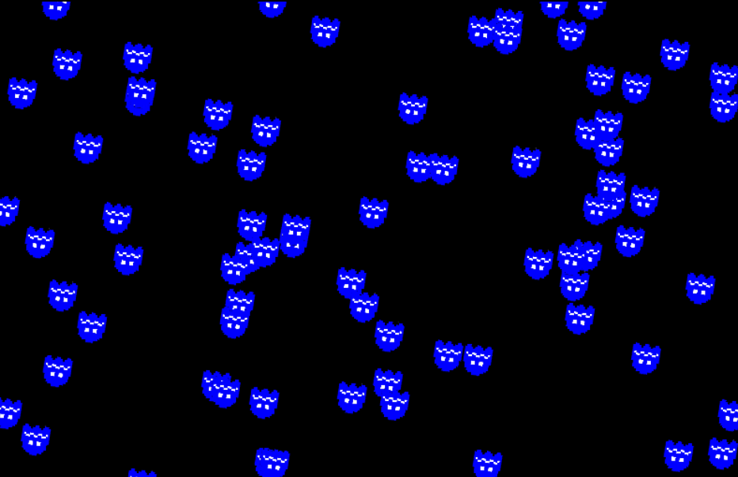

# Installation

## Prerequisites

- you will need [NodeJS](https://nodejs.org/en/download/) installed, version 18 or higher

## Creating a PIXI project

- in your empty directory, initialize a new project by typing `npm init`
- install [ParcelJS bundler](https://parceljs.org/) by typing `npm install --save-dev parcel`
  - **note:** we use Parcel for our examples, but you can use any bundling tool of your choosing (Webpack or Vite)!
- install [PixiJS library](https://pixijs.com/) by typing `npm install pixi.js`
  - install a Pixi Loader that is bundled separately since version 6: `npm install @pixi/loaders`
- your `package.json` should look like this (the version numbers can differ):

```json
{
  "name": "my-project",
  "version": "1.0.0",
  "description": "",
  "main": "index.js",
  "scripts": {
    "test": "echo \"Error: no test specified\" && exit 1"
  },
  "author": "",
  "license": "ISC",
  "devDependencies": {
    "parcel": "^2.10.0"
  },
  "dependencies": {
    "@pixi/loaders": "^6.5.10",
    "pixi.js": "^7.3.2"
  }
}
```

- install a plugin for copying static files during hot-reload: `npm install -D parcel-reporter-static-files-copy`
- create a `static` directory in the root folder of your project
- create a file `.parcelrc` in the root folder of your project and add the following statement (the `...` must be there, indeed):

```json
{
  "extends": ["@parcel/config-default"],
  "reporters":  ["...", "parcel-reporter-static-files-copy"]
}
```

- get a picture and copy it into your static folder (e.g. [creature.png](./assets/creature.png))



## Installing COLFIO library

- install COLFIO library by typing `npm install colfio`
- create two folders: `src` and `view`
- create a file `index.html` in your `view` folder with the following content:
  - this file will be referencing our script file

```html
<!doctype html>
<html>

<head>
    <meta content="text/html;charset=utf-8" http-equiv="Content-Type">
    <meta content="utf-8" http-equiv="encoding">
    <title>My project</title>
</head>
<style type="text/css">
    body {
        background-color: black;
    }
</style>

<body>
    <canvas id="gameCanvas"></canvas>
    <script type="module" src="../src/my-game.ts"></script>
</body>

</html>
```

- create a file `my-game.ts` in your `src` folder with the following content:

```typescript
import * as CF from 'colfio';
import * as PIXI from 'pixi.js';
import { Loader } from '@pixi/loaders';

class MyGame {
    engine: CF.Engine;

    constructor() {
        this.engine = new CF.Engine();
        let canvas = (document.getElementById('gameCanvas') as HTMLCanvasElement);

        // init the game loop
        this.engine.init(canvas, {
            resizeToScreen: true,
            width: 800,
            height: 600,
            resolution: 1,
        });

        const loader = new Loader();
        // using PIXI loader, load all assets
        loader
            .reset()
            .add('creature.png')
            .load(() => this.onAssetsLoaded());
    }

    onAssetsLoaded() {
        // init the scene and run your game
        let scene = this.engine.scene!!;

        // a little hack that generates a loop with 100 runs
        Array(100).fill(0, 0, 100).forEach(() => {
            new CF.Builder(scene)
                // random position anywhere in the scene
                .localPos(Math.random() * this.engine.app!!.screen.width, 
                    Math.random() * this.engine.app!!.screen.height)
                .anchor(0.5)
                .scale(0.15)
                .withParent(scene.stage)
                // create a functional component that will increase the rotation every single frame
                .withComponent(new CF.FuncComponent('rotationAnim')
                    .doOnUpdate((cmp, delta, absolute) => cmp.owner.rotation += 0.001 * delta))
                .asSprite(PIXI.Texture.from('creature.png'))
                .build();
        });
    }
}

// this will create a new instance as soon as this file is loaded
export default new MyGame();

```

- the very last thing would be to create a script that will make parcel build and run the project. Edit the `package.json` file and replace the current `scripts` section with this one:

```json
  "scripts": {
    "dev": "parcel view/index.html",
    "build": "parcel build view/index.html"
  },
```

- `npm run dev` will run a development server. You can now navigate to the url `http://localhost:1234/index.html` to see the example
- `npm run build` will build your project into the `dist` directory


