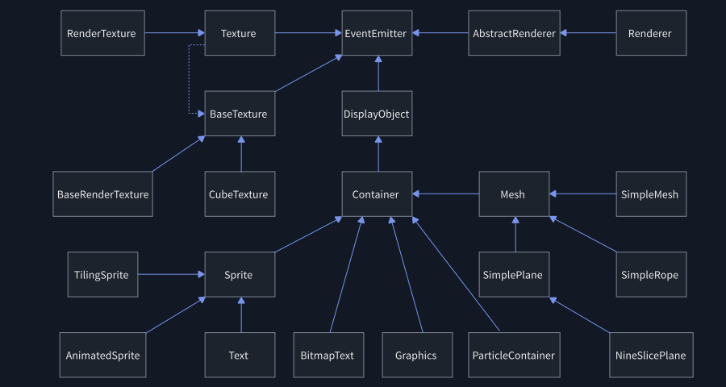
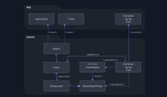
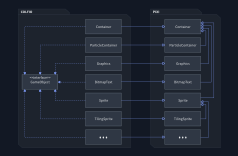
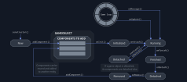
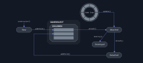
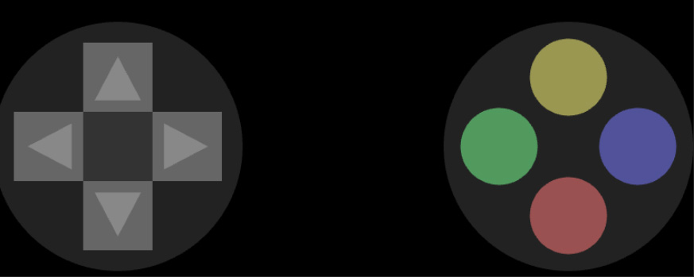
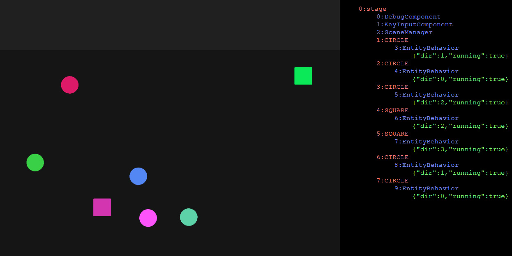

# First Steps

## Architecture


> **Caution:** WIP — a fully-fledged step-by-step tutorial is in progress. For now, check out the drafted documentation of the library taken from github.


### Pixi architecture
- let's first do a quick recap over the overall PIXI architecture



### COLF.IO Architecture



- **PIXI.Application**
  - PIXI application
- **PIXI.Ticker**
  - PIXI clock for game loop
- **PIXI.Container, PIXI.Sprite,...**
  - PIXI game objects
- **COLFIO.Engine**
  - entry point to the library, accepts a configuration object and initializes PIXI game loop
- **COLFIO.Scene**
  - a scene manager, provides querying of components and game objects, manages global components
- **COLFIO.Component**
  - functional components of game objects
  - global components are attached to the `stage` object
- **COLFIO.GameObject**
  - an interface that declares extension methods for PIXI containers
  - in older versions, all components and the `Scene` worked with the containers through `GameObject` interface and accessing PIXI attributes required to use casting functions such as ˙asContainer()˙. The current version uses inherited ˙COLFIO.Container˙, so that it is possible to access both `COLFIO` and `PIXI` functions at the same time. `GameObject` interface is now only used internally for derived objects to force them to implement all `COLFIO` functions
- **COLFIO.GameObjectProxy**
  - a delegate that contains implementation of methods in `COLFIO.GameObject` interface. It's used as a proxy by respective containers (because JavaScript doesn't have multi-inheritance facility)
- **COLFIO.Container, COLFIO.Sprite,...**
  - PIXI containers that inherits from respective PIXI objects, implements `COLFIO.GameObject` interface and passes the implementation on to `COLFIO.GameObjectProxy` (in order to avoid duplicated code)


### PIXI-COLFIO binding

- instead of creating `PIXI.Container`, `PIXI.Sprite` etc., we can create `COLFIO.Container`, `COLFIO.Sprite`,...
- those objects inherit from their respective counterparts in PIXI. Additionally, they contain methods from `COLFIO.GameObject` interface
- they can be treated in the same way as regular PIXI objects
- they use `GameObjectProxy` as a provider of the implementation of COLFIO features
- any functional behaviour can be implemented in components, having them manipulate with game objects they are attached to  



### How to start

- import the COLFIO library
- get your canvas
- call the `init` function
- load your resources by using `PIXI loader`
- access the `engine.scene`

```typescript


class MyGame {
  engine: COLFIO.Engine;

  constructor() {
    this.engine = new COLFIO.Engine();
    let canvas = (document.getElementById('gameCanvas') as HTMLCanvasElement);

    this.engine.init(canvas, { width: 800, height: 600 });

    this.engine.app.loader
        .reset()
        .add('spritesheet', './assets/spritesheet.png')
        .load(onAssetsLoaded);
  }

  onAssetsLoaded = () => {
      this.engine.scene.clearScene();
      const graphics = new COLFIO.Graphics();
      this.engine.scene.stage.addChild(graphics);
  }
}

export default new MyGame();

```

- `engine.app` is a link to `PIXI.Application`
- `scene.stage` is a link to the stage object in PIXI
- `scene.stage.addChild(...)` allows us to add children to the stage object


```typescript
let sprite = new COLFIO.Sprite('mySprite', PIXI.Texture.from('spritesheet'));
sprite.position.set(engine.app.screen.width / 2, engine.app.screen.height / 2);
sprite.anchor.set(0.5);
engine.scene.stage.addChild(sprite);
```

#### Config 

- to optimize query search in the scene, all components and objects are stored in hash maps, sets and array
- in order not to allocate too much memory, searching has to be enabled explicitly
  - don't worry! If you forget to enable it, it will inform you via an Error thrown 🤣

```typescript
new COLFIO.Engine().init(canvas, {
    width: 800,
    height: 600,
    debugEnabled: true,
    flagsSearchEnabled: true,
    statesSearchEnabled: true,
}, true);
```

- `resizeToScreen` - if true, the game will be resized to fit the screen
- `transparent` - if true, the canvas will be trasparent
- `backgroundColor` - canvas background color
- `antialias` - enables antialiasing
- `width` - canvas virtual width
- `height` - canvas virtual height
- `resolution` - scale of displayed objects (1 by default)
- `gameLoopType` - type of the game loop (FIXED, VARIABLE)
- `gameLoopThreshold` - upper threshold of game loop in ms (300 by default)
- `gameLoopFixedTick` - period for fixed game loop (16ms by default)
- `speed` - speed of the game (1 by default)
- `flagsSearchEnabled` - enables searching by flags
- `statesSearchEnabled` - enables searching by states
- `tagsSearchEnabled` - enables searching by tags
- `namesSearchEnabled` - enables searching by names
- `notifyAttributeChanges` - enables notifying when an attribute changes
- `notifyStateChanges` - enables notifying when a state changes
- `notifyFlagChanges` - enables notifying when a flag changes
- `notifyTagChanges` - enables notifying when a tag changes
- `debugEnabled` - injects a debugging HTML element


### Components

- every functional behavior is implemented in components
- every component is attached to one game object
- global components are attached directly to the stage


- `id` - unique identifier
- `name` - component name
- `props` - custom property object (void by default)
- `owner` - game object this component is attached to
- `scene` - link to the scene
- `fixedFrequency` - frequency of the fixed udpate loop (if unset, fixedUpdate() will NOT be invoked)
- `cmpState` - component state (NEW, INITIALIZED, RUNNING, DETACHED, FINISHED)
- `onInit()` - called when the component is added to an object
- `onAttach()` - called when the component is attached to the scene
- `onMessage()` - called whenever a message the component has subscribed to arrives
- `onFixedUpdate(delta, absolute)` - called at a fixed interval (only if `fixedFrequency` is set)
  - `delta` — time since the previous fixed update, in milliseconds
  - `absolute` — time since the engine started, in milliseconds
- `onUpdate(delta, absolute)` - called every frame
  - `delta` — time since the previous frame, in milliseconds
  - `absolute` — time since the engine started, in milliseconds
- `onDetach()` - called before the owner object gets detached from the scene
- `onRemove()` - called before the component is removed from its owner object
- `onFinish()` - called whenever someone calls 'finish()', followed by removing from the scene
- `subscribe()` - subscribes for a message of a given key
- `unsubscribe()` - unsubscribes a message of a given key
- `sendMessage(action, data?, tagFilter?)` - sends a message
  - `tagFilter` — optional list of tags; if set, only components whose owner has at least one of these tags will receive the message
- `finish()` - cancels the execution of the component and removes it from the scene instantly

#### A simple component

- create a new component
- initialize it in `onInit()`
- handle incoming messages in `onMessage()`
- handle update loop in `onUpdate(delta, absolute)`

```typescript
class Movement extends COLFIO.Component {

  onInit() {
    this.subscribe('STOP_EVERYTHING');
  }

  onMessage(msg:  COLFIO.Message) {
    if(msg.action === 'STOP_EVERYTHING') {
      this.finish();
    }
  }

  onUpdate(delta: number, absolute: number) {
    this.owner.pos.set(this.owner.pos.x + 20, this.owner.pos.y);
  }
}
```

#### Lifecycle

- **components are not added to objects instantly**, but at the beginning of the update loop of their respective objects
  - immediate execution can be forced by calling `addComponentAndRun` instead of `addComponent`
- components **can be reused** - removed from an object and added to another one
- a component can be only attached to one game object at a time
- components can receive messages if they are running
- components can't receive message they had sent by themselves
- `finish()` will stop the components from execution and removes it from the scene
- if a game object is to be removed, all of its components will be finalized and removed as well
- if the parent game object gets detached from the scene (e.g. for later reuse), all of its components will be also detached and re-attached afterwards
  - `onAttach()` is called when a component is attached to the scene. It can happen in two cases: 
    - a) component is added to an object that is already on the scene
    - b) a game object is attached to a scene  (so will be its components)
  - if the component is detached, it won't update nor receive any messages
- **recommended**: if you don't need to react on detaching, use only `onInit()` for initialization and `onRemove()` for clean-up




### Game Object

- game object is a class inherited from respective PIXI containers (Container, Sprite, Text, Mesh,...)


- `id` - unique identifier
- `name` - name (empty string by default)
- `stateId` - numeric state
- `pixiObj` - link to a raw object
- `parentGameObject` - link to the parent
- `scene` - link to the scene
- `_proxy_` - link to the proxy that contains implementation of `GameObject` interface
- `asContainer()` - casts itself to `COLFIO.Container`
- `asParticleContainer()` - casts itself to `COLFIO.ParticleContainer`
- `asXYZ()` - casts itself to any class from the list of PIXI containers (throws an error if the casting is not possible)
- `addComponent()` - adds a new component and returns it (for chaining)
- `findComponentByName()` - finds a component by its name
- `removeComponent()` - removes a component
- `assignAttribute()` - adds a new attribute to the hashmap
- `getAttribute()` - gets an attribute by its key
- `removeAttribute()` - removes an existing attribute
- `addTag()` - adds a tag to the set of tags
- `removeTag()` - removes a tag
- `hasTag()` - returns true if given tag is in the set
- `setFlag()` - sets a bit-flag
- `resetFlag()` - resets a bit-flag
- `hasFlag()` - returns true if given bit-flag is set
- `invertFlag()` - inverts given bit-flag
- `detach()` - detaches object from the scene but doesn't destroy it from PIXI
- `destroy()` - destroy the object from the scene and from inner PIXI collections, and removes all of its components
- `destroyChildren()` - destroys all children

```typescript
let newObject = new COLFIO.Sprite('warrior', warriorTexture);

// we can store any number of attributes of any type
newObject.assignAttribute('speed', 20);

// we can store as many tags as we want
newObject.addTag('projectile');

// we can store flags within a range of 1-128
newObject.setFlag(FLAG_COLLIDABLE);

// a numeric state for a simple 
newObject.stateId = STATE_MOVING;
```

#### Lifecycle

- objects are added to the game scene **instantly**
- when an object is attached to the scene, the scene will invoke the update loop upon it (it's being called recursively)
- if the object is detached, it will be removed from the game scene but it will not be destroyed
  - detached objects can be re-added to the scene
- if the object is destroyed, it can no longer be used




### Scene
- serves as a message bus and scene manager


- `app` - link to the `PIXI.Application`
- `name` - name of the scene
- `stage` - root game object, derived from `PIXI.Container`
- `currentDelta` - current delta time
- `currentAbsolute` - current game time
- `callWithDelay(number, function)` - invokes a function with a certain delay
- `addGlobalComponent(cmp)` - adds a global component (attached to the stage)
- `findGlobalComponentByName(name)` - finds a global component by name
- `removeGlobalComponent(component)` - removes a global component
- `assignGlobalAttribute(name, attr)` - assigns a global attribute to the stage
- `getGlobalAttribute(name)` - gets a global atribute by name
- `removeGlobalAttribute(string)` - removes a global attribute
- `findObjectById(id)` - finds objects by id
- `findObjectsByQuery(query)` - finds objects that meet conditions in the query
- `findObjectsByName(name)` - finds objects by name
- `findObjectByName(name)` - gets the first object of given name
- `findObjectsByTag(tag)` - finds objects that have given tag
- `findObjectByTag(tag)` - gets the first object that has given tag
- `findObjectsByFlag(flag)` - finds objects that have given flag set
- `findObjectByFlag(flag)` - gets the first object that has a given flag set
- `findObjectsByState(state)` - finds objects by numeric state
- `findObjectByState(state)` - gets the first object that has a numeric state set
- `sendMessage(message)` - sends a generic message
  - it's better to send message from within components (the message will carry their id)
- `clearScene(config)` - erases the whole scene

#### Scene querying

```typescript
let droids = scene.findObjectsByTag('droid');
let charged = scene.findObjectsByFlag(FLAG_CHARGED);
let idle = scene.findObjectsByState(STATE_IDLE);

let chargedIdleDroids = scene.findObjectsByQuery({
      ownerTag: 'droid',
      ownerFlag: FLAG_CHARGED,
      ownerState: STATE_IDLE
});
```

### Delayed invocation
- don't use `setInterval()` nor `setTimeout()`, as those two methods are invoked from the browser's event loop
- if you want something to happen at a delay, you can use `scene.callWithDelay()` instead, which is invoked at the end of the update loop
- **example: clear the whole scene after 3 seconds**

```typescript
// invoked from within a component
this.scene.callWithDelay(1000, () => this.scene.clearScene());
```


### Messaging

- `Message` is an crate for inter-component communication
- every component contains method `sendMessage(action, data?, tagFilter?)`
- we can also use `scene.sendMessage(Message, tagFilter?)` to send a message from outside a component
- in order to receive messages of a given type, the component first needs to register itself via `subscribe(action)`
- all messages are handled in `OnMessage()` of their respective handlers
  - if the `OnMessage()` handler returns a value, it will be collected in the `responses` structure
- if any component sets `expired = true`, the message will not be passed any furter
- **tagFilter**: optional `string[]` of tags. When provided, the message is delivered only to subscribed components whose `owner` has at least one of those tags

```typescript
// only components on objects tagged 'enemy' will receive this
this.sendMessage('TAKE_DAMAGE', { amount: 10 }, ['enemy']);
```


#### Example: Finish a component by a message

```typescript

class Sender extends COLFIO.Component {

  onInit() {
    this.fixedFrequency = 1;
  }

  onFixedUpdate() {
    this.sendMessage('RECEIVER_FINISH');
  }
}

class Receiver extends COLFIO.Component {

  onInit() {
    this.subscribe('RECEIVER_FINISH');
  }

  onMessage(msg: COLFIO.Message) {
    if(msg.action === 'RECEIVER_FINISH') {
      this.finish(); // will be removed from the scene instantly
    }
  }
}

```

### Built-in messages
- `ANY` - gets all messages (good for debugging)
- `OBJECT_ADDED` - object was added to the scene
- `OBJECT_REMOVED` - object was removed
- `COMPONENT_ADDED` - component was added to an object
- `COMPONENT_DETACHED` - component was detached from the scene (along with its owner)
- `COMPONENT_REMOVED` - component was removed
- `ATTRIBUTE_ADDED` - attribute was added (sent only when `notifyAttributeChanges = true`)
- `ATTRIBUTE_CHANGED` - attribute has changed (sent only when `notifyAttributeChanges = true`)
- `ATTRIBUTE_REMOVED` - attribute was removed (sent only when `notifyAttributeChanges = true`)
- `STATE_CHANGED` - state of an object has changed (sent only when `notifyStateChanges = true`)
- `FLAG_CHANGED` - flag of an object has changed (sent only when `notifyFlagChanges = true`)
- `TAG_ADDED` - tag was added to an object (sent only when `notifyTagChanges = true`)
- `TAG_REMOVED` - tag was removed from an object (sent only when `notifyTagChanges = true`)
- `SCENE_CLEAR` - the whole scene was erased 

#### Example: Collect new objects by messaging pattern 

```typescript

class TreeCollector extends COLFIO.Component {

  trees: COLFIO.Container[] = [];

	onInit() {
		this.subscribe('OBJECT_ADDED');
	}

	onMessage(msg: COLFIO.Message) {
		if (msg.action === 'OBJECT_ADDED' && msg.gameObject.hasTag('TREE')) {
			trees.push(msg.gameObject);
		}
	}
}

```

## Built-in components and tools

### Builder

- a versatile builder for all types of game objects


- `anchor()` - set an anchor
- `virtualAnchor()` - sets an anchor only virtually to calculate positions
- `relativePos()` - relative position on the screen within `[0, 1]` range
- `localPos()` - local position
- `globalPos()` - global position
- `scale()` - local scale
- `withAttribute()` - adds an attribute
- `withComponent()` - adds a component
- `withFlag()` - adds a flag
- `withState()` - adds a state
- `withTag()` - adds a tag
- `withParent()` - sets a parent
- `withChild()` - sets a child Builder
- `withName()` - sets a name
- `asContainer()` - sets the target object as a container 
- `asGraphics()` - sets the target object as graphics
- `asXYZ()` - sets the target object as XYZ (anything from PIXI object collection)
- `buildInto()` - puts the data into an existing object
- `build()` - builds a new object
- `clear()` - clears data

```typescript
new COLFIO.Builder(scene)
    .relativePos(0.5, 0.92)
    .anchor(0.5, 1)
    .withAttribute(Attributes.RANGE, 25)
    .withFlag(FLAG_COLLIDABLE)
    .withFlag(FLAG_RANGE)
    .withState(STATE_IDLE)
    .withComponent(new TowerComponent())
    .withComponent(new AimControlComponent())
    .withComponent(new ProjectileSpawner())
    .withName('tower')
    .asSprite(PIXI.Texture.from(Assets.TEX_TOWER))
    .withParent(rootObject)
.build();
```


### Chain Component

- very powerful implementation of chain-of-commands
- **every action is bound to the game update loop** - the component udpates it inner state and invokes commands only when it's its turn


```typescript
// displays a sequence of fancy rotating texts whilst in the bonus mode
this.owner.addComponent(new ChainComponent()
  .beginWhile(() => this.gameModel.mode === BONUS_LEVEL)
      .beginRepeat(4)
          .waitFor(() => new RotationAnimation(0,360))
          .waitFor(() => new TranslateAnimation(0,0,2,2))
          .call(() => textComponent.displayMessage('BONUS 100 POINTS!!!'))
          .call(() => soundComponent.playSound('bonus'))
      .endRepeat()
  .endWhile()
  .call(() => viewComponent.removeAllTexts()));
 
// changes background music every 20 seconds
this.owner.addComponent(new ChainComponent()
  .waitForMessage('GAME_STARTED')
  .beginWhile(() => this.scene.stage.hasFlag(GAME_RUNNING))
    .waitTime(20000)
    .call(() => this.changeBackgroundMusic())
  .endWhile()
```

### Functional component

- a generic component that serves as a wrapper for simple functions


```typescript
new COLFIO.FuncComponent('view')
    .setFixedFrequency(0.1) // 1 update per 10 seconds
    .doOnMessage('UNIT_EXPLODED', (cmp, msg) => cmp.playSound(Sounds.EXPLOSION))
    .doOnMessage('UNIT_SPAWNED', (cmp, msg) => cmp.displayWarning(Warnings.UNIT_RESPAWNED))
    .doOnFixedUpdate((cmp, delta, absolute) => cmp.displayCurrentState())
```

### Key-Input Component
- a simple keyboard handled that only stores pressed keys
- doesn't send any messages, it has to be polled manually

```typescript
// Factory.ts
initGame(scene: COLFIO.Scene) {
  ...
  // here we need to add the KeyInputComponent globally
  scene.addGlobalComponent(new KeyInputComponent());
  ...
}

// CannonInputController.ts
export class CannonInputController extends CannonController {

onUpdate(delta: number, absolute: number) {
    // assuming that we added this component to the stage
    let cmp = this.scene
      .findGlobalComponentByName<KeyInputComponent>(COLFIO.KeyInputComponent.name);
 
    if (cmp.isKeyPressed(COLFIO.Keys.KEY_LEFT)) {
      this.turnLeft();
    }
 
    if (cmp.isKeyPressed(COLFIO.Keys.KEY_RIGHT)) {
      this.turnRight();
    }
  }
}
```

### Pointer-Input Component
- a global pointer handler
- PIXI has a built-in support for mouse events; this component handles mouse/pointer events for the canvas as a whole
- unlike `Key-Input Component`, this one is using messaging pattern to notify the observers
- the component handles both a mouse and a pointer
- **config**
  - you need to explicitly configure which events should be captured
  - `handleClick` will capture down/release actions

```typescript
// add component
obj.addComponent(new COLFIO.PointerInputComponent( {
  handleClick: false,
  handlePointerDown: true,
  handlePointerOver: true,
  handlePointerRelease: true, 
}));

```
- then, you can subscribe for following messages (you can find the enum in `COLFIO.PointerMessages`):
  - `pointer-tap`
  - `pointer-down`
  - `pointer-over`
  - `pointer-release`

### Virtual-Gamepad Component
- a simple gamepad that extends `KeyInputComponent` and translates clicks to keys
- if you replace your `KeyInputComponent` with `VirtualGamepadComponent`, your game shouldn't notice the difference
- **config**
  - you need to provide a mapper to the keys
  - if you omit certain keys, respective buttons will not render

```typescript
		this.engine.scene.addGlobalComponent(new COLFIO.VirtualGamepadComponent({
			KEY_UP: COLFIO.Keys.KEY_UP,
			KEY_DOWN: COLFIO.Keys.KEY_DOWN,
			KEY_LEFT: COLFIO.Keys.KEY_LEFT,
			KEY_RIGHT: COLFIO.Keys.KEY_RIGHT,
			KEY_A: COLFIO.Keys.KEY_SPACE,
			KEY_B: COLFIO.Keys.KEY_ENTER,
			KEY_X: COLFIO.Keys.KEY_ALT,
			KEY_Y: COLFIO.Keys.KEY_SHIFT
		}));
```

- this being configured, the scene will contain a gamepad rendered on the top



### Vector
- helper class for vectors


### Responsive mode
- if you want your game render in full-screen mode, scaling with the browser window, you have 2 options:
  - 1) set `resizeToScreen` to `true` while initializing the engine
  - 2) add `?responsive` query string


### Debug Component

- debug component will attach a debugging panel next to the canvas
- three ways:
  - 1) add `DebugComponent` to the stage
  - 2) add `?debug` query string
  - 3) set `debugEnabled` to `true` while initializing the engine

